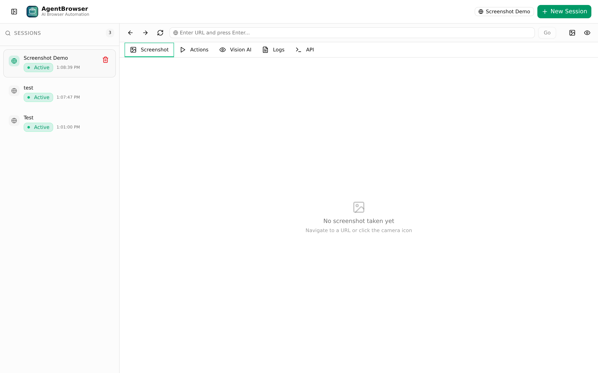
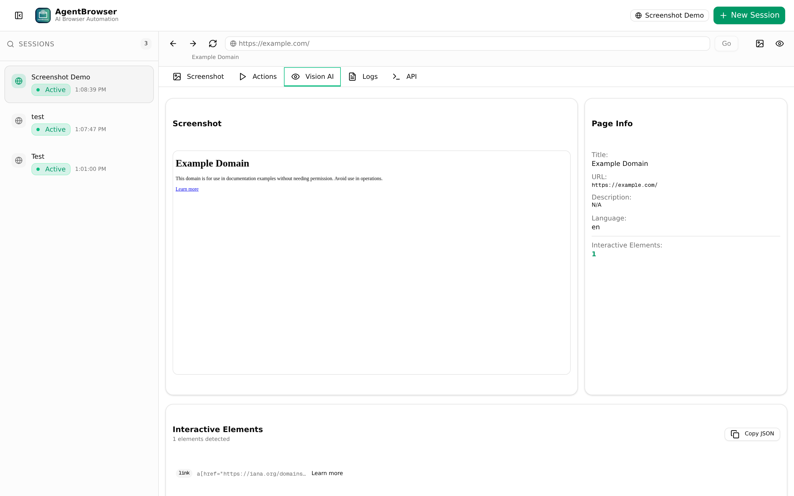

<div align="center">


# AgentBrowser

**AI-Powered Browser Automation Platform**

[](LICENSE)
[](https://github.com/smouj/agent-browser/releases)
[](https://nextjs.org/)
[](https://www.typescriptlang.org/)
[](https://playwright.dev/)
[](https://tailwindcss.com/)
[](https://www.prisma.io/)

*Give any AI agent a real browser. REST API + Web Dashboard + Vision AI.*

[Documentation](https://smouj.github.io/agent-browser) &middot; [Quick Start](#-quick-start) &middot; [API Docs](#-rest-api) &middot; [AI Agent Guide](#-using-with-ai-agents) &middot; [Architecture](#-architecture)



</div>

---

## What is AgentBrowser?

AgentBrowser is an open-source browser automation platform designed to be the **hands and eyes of AI agents**. It provides a REST API and real-time WebSocket interface for controlling real browser instances — letting LLMs, CLIs, and autonomous agents navigate the web, interact with pages, extract data, and perform complex multi-step tasks.

Built on **Next.js 16**, **Playwright**, and **TypeScript**, it ships with a professional web dashboard for real-time monitoring and control, a comprehensive REST API for programmatic access, and a built-in Vision AI system that provides screenshots, simplified DOM, accessibility trees, and interactive element detection.

**Why AgentBrowser?**

- Most browser automation tools are designed for testing. AgentBrowser is designed for **AI agents**.
- Clean REST API that any LLM can call — no browser-specific knowledge required.
- Vision AI reduces web pages to structured data that language models can reason about.
- Session persistence means agents can pick up where they left off.
- Compatible with **OpenClaw**, **Hermes**, **OpenAI Function Calling**, and any custom agent framework.

---

## Features

### Browser Engine
- Multi-browser support — **Chromium**, **Firefox**, and **WebKit** via Playwright
- Session management — Persistent cookies, localStorage, and browser state across requests
- Headless & headed modes — Run headless on servers, headed for debugging
- Configurable viewports — Custom screen sizes and resolutions
- Proxy support — Route traffic through HTTP/HTTPS proxies with authentication

### 25+ Browser Actions
- **Navigation** — `navigate`, `goBack`, `goForward`, `reload`
- **Mouse** — `click`, `dblclick`, `hover`, `rightClick`
- **Keyboard** — `type`, `press`, `select`
- **Scrolling** — `scroll` with direction and element targeting
- **Waiting** — `wait`, `waitForSelector`, `waitForNavigation`
- **Screenshots** — Full page, element-specific, PNG/JPEG
- **JavaScript** — `evaluate` arbitrary JS in the page context
- **Cookies** — `getCookies`, `setCookies`, `clearCookies`
- **Storage** — `getLocalStorage`, `setLocalStorage`, `clearLocalStorage`
- **Info** — `getUrl`, `getTitle`, `getContent`

### Vision AI



- **Screenshots** — Base64 PNG/JPEG screenshots on demand
- **Simplified DOM** — Cleaned HTML with interactive elements highlighted
- **Accessibility tree** — Full a11y tree for screen-reader-style understanding
- **Interactive element detection** — Auto-detects buttons, links, inputs, and more with selectors and coordinates
- **Page metadata** — Title, description, OG tags, favicon, language

### Developer Experience
- **REST API** — 8 clean JSON endpoints compatible with any LLM, CLI, or SDK
- **Real-time WebSocket** — Live updates on actions, screenshots, and session changes via Socket.IO
- **Web Dashboard** — Professional dark-themed UI with session management, live preview, and action logs
- **TypeScript** — End-to-end type safety with exported types
- **SQLite + Prisma** — Zero-config persistence for sessions and action logs
- **Action logging** — Every browser action is recorded with timing and results

---

## Quick Start

### Prerequisites

- **Node.js** 18+ or **Bun** 1.x
- **Playwright browsers** (installed automatically via postinstall)

### Install

```bash
# Clone the repository
git clone https://github.com/smouj/agent-browser.git
cd agent-browser

# Install dependencies
bun install
# or: npm install

# Set up the database
bun run db:push
# or: npx prisma db push

# Install Playwright browsers (if not already installed)
bunx playwright install chromium
```

### Run

```bash
# Development mode (hot reload, port 3000)
bun run dev

# Production mode
bun run build
bun run start
```

Open [http://localhost:3000](http://localhost:3000) to access the web dashboard.

### One-Line Setup

```bash
git clone https://github.com/smouj/agent-browser.git && cd agent-browser && bun install && bun run db:push && bunx playwright install chromium && bun run dev
```

---

## AI Agent Integration Guide

### How It Works

AgentBrowser follows a simple **observe-think-act loop**:

```
1. CREATE SESSION  → POST /api/browser/sessions
2. NAVIGATE        → POST /sessions/{id}/action  { action: "navigate" }
3. OBSERVE         → POST /sessions/{id}/vision   (screenshot + DOM + elements)
4. THINK           → LLM analyzes vision data and decides next action
5. ACT             → POST /sessions/{id}/action  { action: "click/type/scroll" }
6. REPEAT 3-5      → Until task is complete
7. CLEANUP         → DELETE /sessions/{id}
```

### OpenClaw Integration

OpenClaw uses tool-calling to interact with external services. Register AgentBrowser as a set of tools:

**1. Start AgentBrowser:**
```bash
bun run dev  # http://localhost:3000
```

**2. Create a tool definition** in your OpenClaw project (`tools/browser.yaml`):
```yaml
name: browser_navigate
description: "Navigate the browser to a URL"
endpoint: "http://localhost:3000/api/browser/sessions/{session_id}/action"
method: POST
parameters:
  session_id:
    type: string
    description: "Active browser session ID"
  action:
    type: string
    default: "navigate"
  target:
    type: string
    description: "URL to navigate to"
```

**3. Register all tools:** `browser_navigate`, `browser_click`, `browser_type`, `browser_vision`, `browser_screenshot`, `browser_scroll`

**4. Create a session at startup** and pass the `session_id` to all tool calls

**5. Use Vision AI** to let the agent "see" the page before deciding what to do

### Hermes Integration

Hermes supports MCP (Model Context Protocol) servers. Add AgentBrowser to your Hermes config:

```yaml
# hermes.config.yaml
mcp_servers:
  agentbrowser:
    type: "rest"
    base_url: "http://localhost:3000/api/browser"
    tools:
      - name: "create_session"
        path: "/sessions"
        method: "POST"
      - name: "execute_action"
        path: "/sessions/{session_id}/action"
        method: "POST"
      - name: "get_vision"
        path: "/sessions/{session_id}/vision"
        method: "POST"
      - name: "close_session"
        path: "/sessions/{session_id}"
        method: "DELETE"
```

### OpenAI Function Calling

Define AgentBrowser as an OpenAI tool:

```python
tools = [{
    "type": "function",
    "function": {
        "name": "browser_navigate",
        "description": "Navigate browser to a URL",
        "parameters": {
            "type": "object",
            "properties": {
                "url": {"type": "string"}
            },
            "required": ["url"]
        }
    }
}, {
    "type": "function",
    "function": {
        "name": "browser_vision",
        "description": "Get AI vision snapshot - screenshot, DOM, interactive elements",
        "parameters": {
            "type": "object",
            "properties": {
                "full_page": {"type": "boolean", "default": False}
            }
        }
    }
}, {
    "type": "function",
    "function": {
        "name": "browser_click",
        "description": "Click an element on the page using a CSS selector",
        "parameters": {
            "type": "object",
            "properties": {
                "selector": {"type": "string"}
            },
            "required": ["selector"]
        }
    }
}]
```

### Python Agent Example

```python
import requests

BASE = "http://localhost:3000/api/browser/sessions"

# 1. Create session
s = requests.post(BASE, json={
    "name": "python-agent",
    "browserType": "chromium",
    "headless": True
}).json()
sid = s["id"]

# 2. Navigate
requests.post(f"{BASE}/{sid}/action", json={
    "action": "navigate",
    "target": "https://news.ycombinator.com"
})

# 3. Get vision (for LLM)
vision = requests.post(f"{BASE}/{sid}/vision", json={}).json()

# 4. Pass interactive elements to your LLM
for el in vision["interactiveElements"]:
    print(f"{el['type']}: {el['text']} → {el['selector']}")

# 5. Clean up
requests.delete(f"{BASE}/{sid}")
```

---

## REST API

All endpoints return JSON. Base URL: `http://localhost:3000`

### Sessions

| Method | Endpoint | Description |
|--------|----------|-------------|
| `POST` | `/api/browser/sessions` | Create a new browser session |
| `GET` | `/api/browser/sessions` | List all sessions |
| `GET` | `/api/browser/sessions/:id` | Get session details |
| `DELETE` | `/api/browser/sessions/:id` | Close and delete a session |
| `POST` | `/api/browser/sessions/:id/action` | Execute a browser action |
| `POST` | `/api/browser/sessions/:id/vision` | Get AI vision snapshot |
| `GET/POST` | `/api/browser/sessions/:id/cookies` | Get or set cookies |
| `GET` | `/api/browser/sessions/:id/logs` | Get paginated action logs |

### Create a Session

```bash
curl -X POST http://localhost:3000/api/browser/sessions \
  -H "Content-Type: application/json" \
  -d '{
    "name": "my-agent-session",
    "browserType": "chromium",
    "headless": true
  }'
```

**Request body:**

| Field | Type | Default | Description |
|-------|------|---------|-------------|
| `name` | `string` | Auto-generated | Session name |
| `browserType` | `"chromium" \| "firefox" \| "webkit"` | `"chromium"` | Browser engine |
| `headless` | `boolean` | `true` | Run without UI |
| `proxy` | `object` | `undefined` | Proxy config (`server`, `username?`, `password?`) |
| `viewport` | `object` | `{width: 1280, height: 720}` | Viewport size |
| `userAgent` | `string` | Browser default | Custom user agent |
| `locale` | `string` | `"en-US"` | Browser locale |
| `timezone` | `string` | `"America/New_York"` | Browser timezone |

### Execute an Action

```bash
# Navigate
curl -X POST http://localhost:3000/api/browser/sessions/{id}/action \
  -H "Content-Type: application/json" \
  -d '{"action":"navigate","target":"https://example.com"}'

# Click
curl -X POST http://localhost:3000/api/browser/sessions/{id}/action \
  -H "Content-Type: application/json" \
  -d '{"action":"click","target":"button#submit"}'

# Type
curl -X POST http://localhost:3000/api/browser/sessions/{id}/action \
  -H "Content-Type: application/json" \
  -d '{"action":"type","target":"input#search","value":"hello","options":{"pressEnter":true}}'

# Screenshot
curl -X POST http://localhost:3000/api/browser/sessions/{id}/action \
  -H "Content-Type: application/json" \
  -d '{"action":"screenshot","options":{"fullPage":true}}'
```

### Get Vision Snapshot

```bash
curl -X POST http://localhost:3000/api/browser/sessions/{id}/vision \
  -H "Content-Type: application/json" \
  -d '{}'
```

Returns: screenshot (base64), simplified DOM, accessibility tree, interactive elements with selectors, and page metadata.

### Supported Actions

| Category | Action | `target` | `value` | `options` |
|----------|--------|----------|---------|-----------|
| **Navigation** | `navigate` | URL | — | `waitUntil`, `timeout` |
| | `goBack` | — | — | — |
| | `goForward` | — | — | — |
| | `reload` | — | — | `waitUntil` |
| **Mouse** | `click` | CSS selector | — | `button`, `clickCount`, `delay` |
| | `dblclick` | CSS selector | — | `delay` |
| | `hover` | CSS selector | — | — |
| | `rightClick` | CSS selector | — | `delay` |
| **Keyboard** | `type` | CSS selector | Text to type | `clear`, `pressEnter`, `delay` |
| | `press` | — | Key name | — |
| | `select` | CSS selector | Option value | — |
| **Scroll** | `scroll` | Direction | Pixel amount | `element` |
| **Wait** | `wait` | — | Milliseconds | — |
| | `waitForSelector` | CSS selector | — | `state`, `timeout` |
| | `waitForNavigation` | — | — | `waitUntil`, `timeout` |
| **Capture** | `screenshot` | — | — | `fullPage`, `element`, `quality`, `type` |
| **JS** | `evaluate` | — | JS expression | — |
| **Cookies** | `getCookies` | — | — | — |
| | `setCookies` | — | JSON cookies array | — |
| | `clearCookies` | — | — | — |
| **Storage** | `getLocalStorage` | — | — | — |
| | `setLocalStorage` | — | JSON key-value pairs | — |
| | `clearLocalStorage` | — | — | — |
| **Info** | `getUrl` | — | — | — |
| | `getTitle` | — | — | — |
| | `getContent` | — | — | — |

---

## WebSocket Events

AgentBrowser emits real-time events via Socket.IO for live dashboards and reactive agent loops.

```javascript
const socket = io('http://localhost:3000');

socket.on('action', (event) => {
  console.log(`[${event.sessionId}] ${event.action} → ${event.result.success ? 'OK' : 'FAIL'}`);
});

socket.on('session_update', (event) => {
  console.log(`Session ${event.sessionId}: ${event.data.currentUrl}`);
});

socket.on('screenshot', (event) => {
  const img = Buffer.from(event.screenshot, 'base64');
});
```

**Event types:** `session_created`, `session_update`, `session_closed`, `action`, `screenshot`

---

## Configuration

### Environment Variables

Create a `.env` file in the project root:

```env
# Database (SQLite)
DATABASE_URL="file:./custom.db"

# Server
PORT=3000
NODE_ENV="development"

# Browser defaults
DEFAULT_BROWSER_TYPE="chromium"
DEFAULT_HEADLESS=true
DEFAULT_VIEWPORT_WIDTH=1280
DEFAULT_VIEWPORT_HEIGHT=720

# Session limits
SESSION_TIMEOUT_MS=3600000
MAX_CONCURRENT_SESSIONS=10
```

---

## Architecture

```
┌─────────────────────────────────────────────────────┐
│                    Clients                          │
│         LLMs · CLIs · Web Dashboard                │
└──────────────┬──────────────────┬──────────────────┘
               │  REST API        │  WebSocket
┌──────────────▼──────────────────▼──────────────────┐
│              Next.js API Routes                     │
│    /api/browser/sessions/*                         │
└──────────────┬─────────────────────────────────────┘
               │
┌──────────────▼─────────────────────────────────────┐
│           Browser Engine Layer                      │
│    Session Manager · Action Executor · Vision       │
└──────────────┬─────────────────────────────────────┘
               │
┌──────────────▼─────────────────────────────────────┐
│              Playwright                             │
│    Chromium · Firefox · WebKit                     │
└────────────────────────────────────────────────────┘
               │
┌──────────────▼─────────────────────────────────────┐
│          SQLite (via Prisma)                        │
│    Sessions · Action Logs                           │
└────────────────────────────────────────────────────┘
```

| Module | Path | Description |
|--------|------|-------------|
| API Routes | `src/app/api/browser/sessions/` | REST endpoints for session and action management |
| Browser Engine | `src/lib/browser/engine.ts` | Singleton session lifecycle manager |
| Action Executor | `src/lib/browser/actions.ts` | 25+ browser actions with logging |
| Vision System | `src/lib/browser/vision.ts` | Screenshots, DOM simplification, a11y tree |
| Types | `src/lib/browser/types.ts` | TypeScript interfaces for all API types |
| Database | `prisma/schema.prisma` | Session and action log persistence |
| Dashboard | `src/app/page.tsx` | Web UI with session sidebar and live updates |

---

## Tech Stack

| Technology | Purpose |
|------------|---------|
| [Next.js 16](https://nextjs.org/) | Full-stack React framework, API routes |
| [TypeScript](https://www.typescriptlang.org/) | End-to-end type safety |
| [Tailwind CSS 4](https://tailwindcss.com/) | Utility-first styling |
| [shadcn/ui](https://ui.shadcn.com/) | UI component library |
| [Playwright](https://playwright.dev/) | Browser automation engine |
| [Prisma](https://www.prisma.io/) | Type-safe database ORM (SQLite) |
| [Socket.IO](https://socket.io/) | Real-time WebSocket communication |
| [Zustand](https://zustand.docs.pmnd.rs/) | Client-side state management |

---

## Project Structure

```
agent-browser/
├── assets/                         # Logo, screenshots, OG image
├── docs/                           # GitHub Pages documentation
│   └── index.html                  # Full documentation site
├── src/
│   ├── app/
│   │   ├── api/browser/sessions/
│   │   │   ├── route.ts            # POST (create), GET (list)
│   │   │   └── [id]/
│   │   │       ├── route.ts        # GET (detail), DELETE (close)
│   │   │       ├── action/route.ts # POST (execute action)
│   │   │       ├── vision/route.ts # POST (vision snapshot)
│   │   │       ├── cookies/route.ts# GET, POST (cookies)
│   │   │       └── logs/route.ts   # GET (action logs)
│   │   ├── layout.tsx
│   │   ├── page.tsx                # Web dashboard
│   │   └── globals.css
│   ├── components/ui/              # shadcn/ui components
│   ├── lib/
│   │   ├── browser/
│   │   │   ├── engine.ts           # Session lifecycle manager
│   │   │   ├── actions.ts          # 25+ action executor
│   │   │   ├── vision.ts           # Vision AI system
│   │   │   ├── session.ts          # Session helpers
│   │   │   ├── types.ts            # TypeScript interfaces
│   │   │   └── utils.ts            # Utility functions
│   │   ├── db.ts                   # Prisma client
│   │   └── utils.ts                # General utilities
│   └── hooks/                      # React hooks
├── prisma/
│   └── schema.prisma               # Database schema
├── public/                         # Static assets
└── package.json
```

---

## Comparison with Alternatives

AgentBrowser vs other AI browser automation tools:

| Feature | AgentBrowser | Browser Use | Stagehand | Playwright MCP |
|---------|-------------|-------------|----------|----------------|
| Self-hosted | Yes | Yes | No (cloud) | Yes |
| REST API | 8 endpoints | No | SDK only | MCP only |
| Multi-browser | Chromium, Firefox, WebKit | Chromium only | Chromium only | All 3 |
| Vision AI | Screenshots, DOM, a11y tree, elements | Screenshot only | DOM only | None |
| Session persistence | Cookies, localStorage, DB | Memory only | No | No |
| Web Dashboard | Yes (dark theme) | No | No | No |
| WebSocket events | Yes | No | No | No |
| 25+ browser actions | Yes | Limited | Limited | Basic |
| Agent agnostic | Any LLM/CLI | Python only | JS/Python | Any MCP client |
| License | MIT | MIT | Commercial | MIT |
| Database | SQLite + Prisma | None | Cloud | None |

**Notable alternatives not in the table:**

- **[LaVague](https://lavague.ai)** — RAG-based, research-focused approach with no REST API.
- **[Skyvern](https://skyvern.com)** — Commercial cloud platform with no self-hosting option, workflow-only.
- **WebVoyager** — Academic/research project, not production-ready.

AgentBrowser is the only open-source solution that combines a full REST API, Vision AI system, session persistence, AND a web dashboard — making it the most complete platform for AI browser automation.

---

## Contributing

Contributions are welcome! Please read our [Contributing Guidelines](CONTRIBUTING.md) before submitting a pull request.

1. Fork the repository
2. Create your feature branch (`git checkout -b feature/amazing-feature`)
3. Commit your changes (`git commit -m 'Add amazing feature'`)
4. Push to the branch (`git push origin feature/amazing-feature`)
5. Open a Pull Request

---

## License

This project is licensed under the MIT License. See the [LICENSE](LICENSE) file for details. 2026 

---

<div align="center">

**Built with Next.js, Playwright, and TypeScript**

Made for AI agents, by developers who build with AI agents.

</div>
